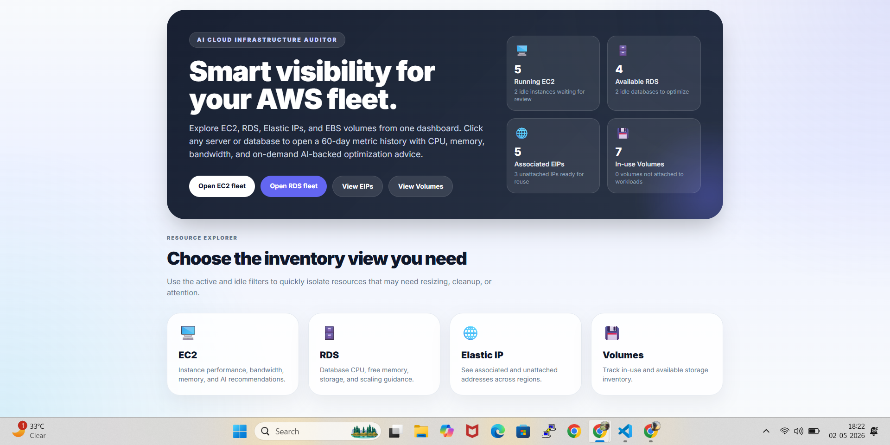
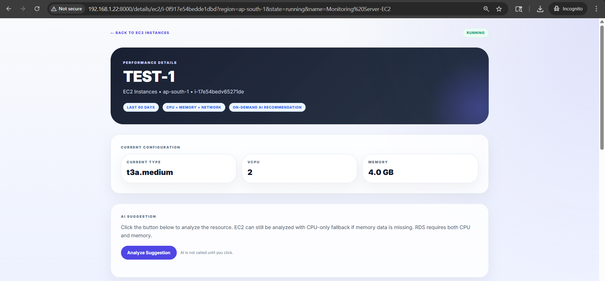
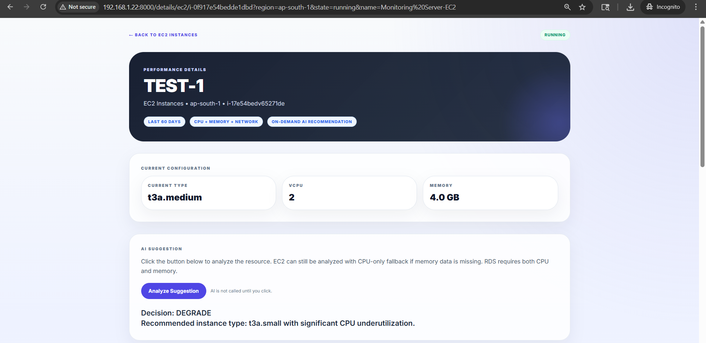
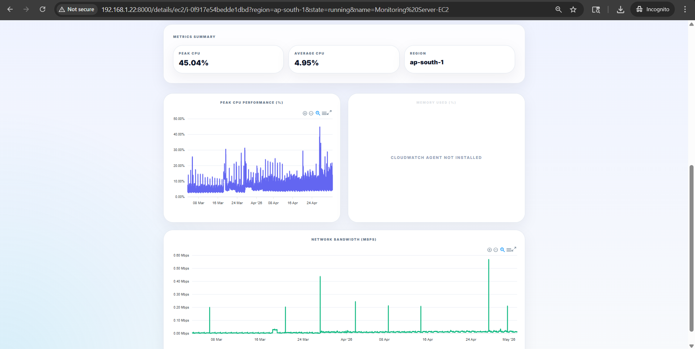
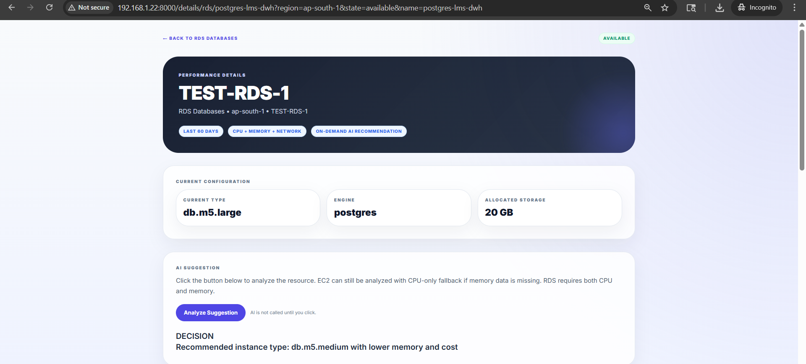
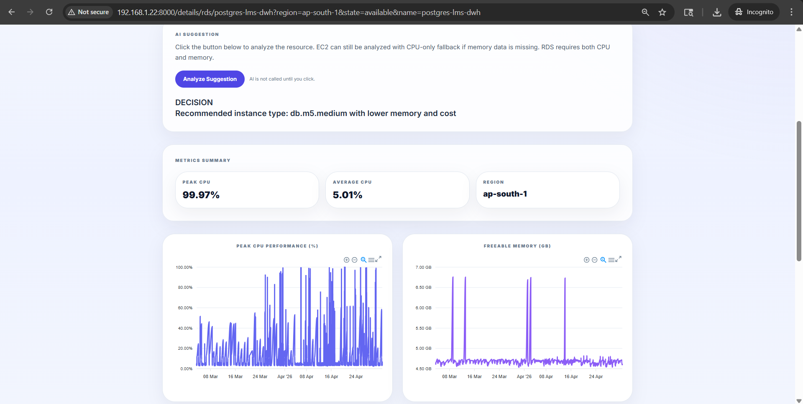
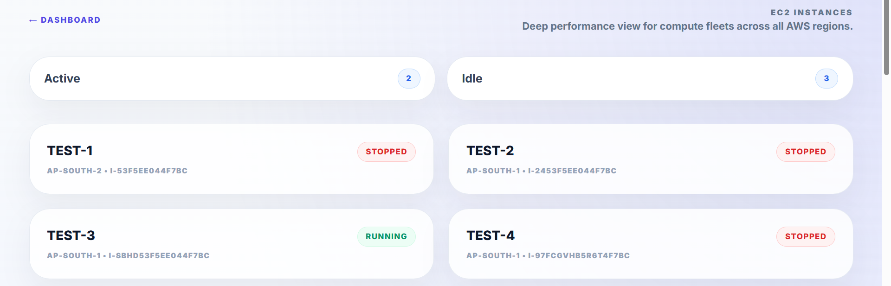
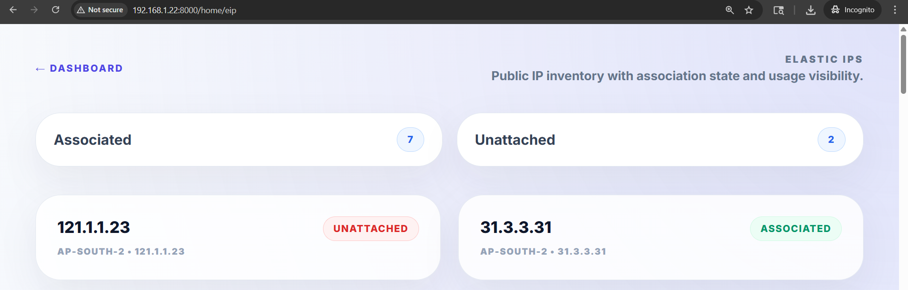
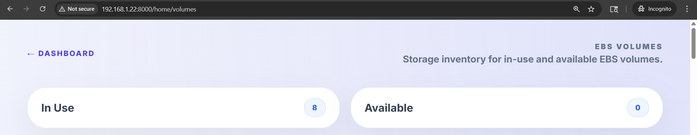

Here’s a **clean, professional, GitHub-ready README.md** for your project 👇

---

# 🚀 AI Cloud Infrastructure Auditor

An intelligent **AWS infrastructure monitoring and optimization dashboard** built with **FastAPI**, **CloudWatch**, and **Gemini AI**.

This tool provides **real-time inventory visibility**, **60-day performance insights**, and **AI-powered right-sizing recommendations** for EC2 and RDS resources.

---

## 🌟 Features

### 📊 Multi-Resource Dashboard

* EC2 Instances
* RDS Databases
* Elastic IPs
* EBS Volumes

### 📈 Advanced Metrics Visualization

* 60-day historical data
* CPU utilization (avg, peak, p95)
* Memory usage (via CloudWatch Agent)
* Network bandwidth (Mbps)
* Storage metrics (RDS)

### 🤖 AI-Powered Recommendations

* Uses **Google Gemini API**
* Suggests:

  * 🔼 Upgrade
  * 🔽 Degrade
  * ⚖️ Maintain
* Provides **instance type recommendation + reason**
* Strict **2-line decision output**

### ⚡ Smart Filtering

* Active vs Idle resources
* Associated vs Unassociated EIPs
* In-use vs Available volumes

### 🧠 Intelligent Logic

* CPU & Memory threshold-based decisions
* Works even if memory is unavailable (EC2 fallback)
* RDS requires both CPU + memory

---

## 🏗️ Architecture

```
Frontend (HTML + Tailwind + ApexCharts)
            ↓
FastAPI Backend
            ↓
AWS SDK (Boto3)
            ↓
CloudWatch Metrics
            ↓
Gemini AI (Recommendation Engine)
```

---

## 📂 Project Structure

```
.
├── main.py                # Main FastAPI application
├── .env                  # Environment variables
├── requirements.txt      # Python dependencies
└── README.md             # Project documentation
```

---

## ⚙️ Setup Instructions

### 1️⃣ Clone Repository

```bash
git clone https://github.com/your-username/ai-cloud-auditor.git
cd ai-cloud-auditor
```

---

### 2️⃣ Create Virtual Environment

```bash
python -m venv env
source env/bin/activate     # Linux/Mac
env\Scripts\activate        # Windows
```

---

### 3️⃣ Install Dependencies

```bash
pip install -r requirements.txt
```

---

### 4️⃣ Configure Environment Variables

Create a `.env` file:

```env
GEMINI_API_KEY=your_gemini_api_key
GEMINI_MODEL=gemini-2.5-flash
```

---

### 5️⃣ Configure AWS Credentials

Make sure AWS CLI is configured:

```bash
aws configure
```

Or use environment variables:

```env
AWS_ACCESS_KEY_ID=your_key
AWS_SECRET_ACCESS_KEY=your_secret
AWS_DEFAULT_REGION=ap-south-1
```

---

### 6️⃣ Run Application

```bash
python main.py
```

App will be available at:

👉 [http://127.0.0.1:8000](http://127.0.0.1:8000)

---

## 📸 Screens

### 🏠 Dashboard

* Overview of all AWS resources
* Quick stats (active, idle, unused)

### 📋 Inventory View

* Filter resources by state
* Click any resource for details

### 📊 Resource Details

* Interactive charts:

  * CPU
  * Memory
  * Network
  * Storage (RDS)
* AI recommendation button

---

## 🤖 AI Decision Logic

| Condition     | Action      |
| ------------- | ----------- |
| CPU avg < 35% | 🔽 Degrade  |
| CPU p95 > 80% | 🔼 Upgrade  |
| Otherwise     | ⚖️ Maintain |

Example Output:

```
UPGRADE
Recommended instance type: t3.large due to high CPU utilization
```

---

## 🔐 IAM Permissions Required

Minimum required AWS permissions:

* EC2:

  * `ec2:DescribeInstances`
  * `ec2:DescribeVolumes`
  * `ec2:DescribeAddresses`
  * `ec2:DescribeInstanceTypes`

* RDS:

  * `rds:DescribeDBInstances`

* CloudWatch:

  * `cloudwatch:GetMetricData`

---

## ⚠️ Important Notes

* Memory metrics for EC2 require **CloudWatch Agent**
* RDS analysis requires:

  * CPU metrics
  * Freeable memory
* AI is **triggered on-demand** (not auto-called)

---

## 🚀 Future Enhancements

* 🔔 Cost optimization alerts
* 📉 Monthly cost estimation
* 📊 Savings recommendations
* ☸️ Kubernetes support (EKS)
* 📦 Auto-scaling suggestions
* 🧾 Report export (PDF/Excel)
* 🔐 Role-based access control

---

## 🛠️ Tech Stack

* **Backend:** FastAPI
* **Cloud SDK:** Boto3
* **AI Engine:** Google Gemini API
* **Frontend:** Tailwind CSS + ApexCharts
* **Caching:** cachetools

---

## 💡 Use Cases

* DevOps Engineers
* Cloud Architects
* FinOps Teams
* Startup Infra Monitoring
* Cost Optimization Analysis

---


## 🖼️ Full Screenshot Gallery

<details>
<summary>Click to view all screenshots</summary>

<br>

<br><br>
<br><br>
<br><br>
<br><br>
<br><br>
<br><br>
<br><br>
<br><br>
<br><br>

</details>

---

## 🤝 Contributing

Contributions are welcome!

```bash
fork → clone → create branch → commit → PR
```

---

## 📄 License

This project is licensed under the MIT License.

---

## 👨‍💻 Author

**Nipun Yadav**

---

## ⭐ Support

If you like this project:

👉 Star the repo
👉 Share with others
👉 Contribute improvements

